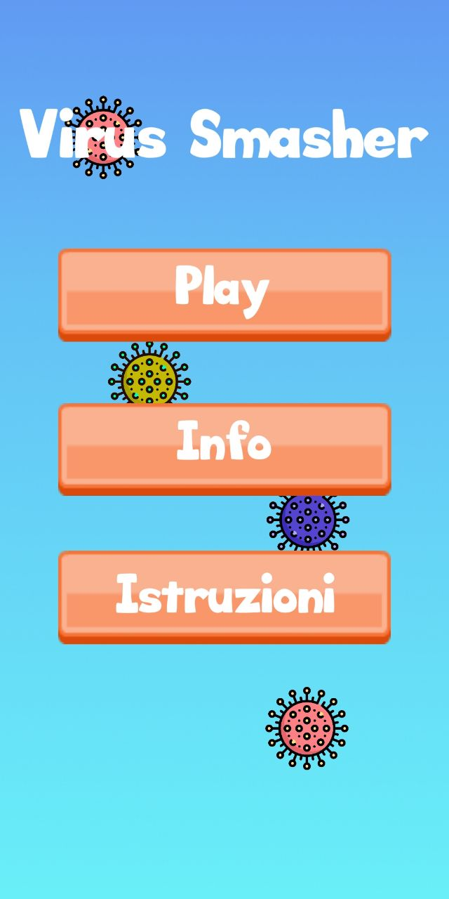
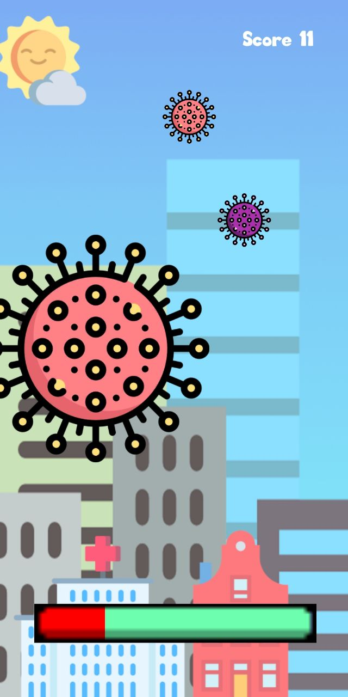
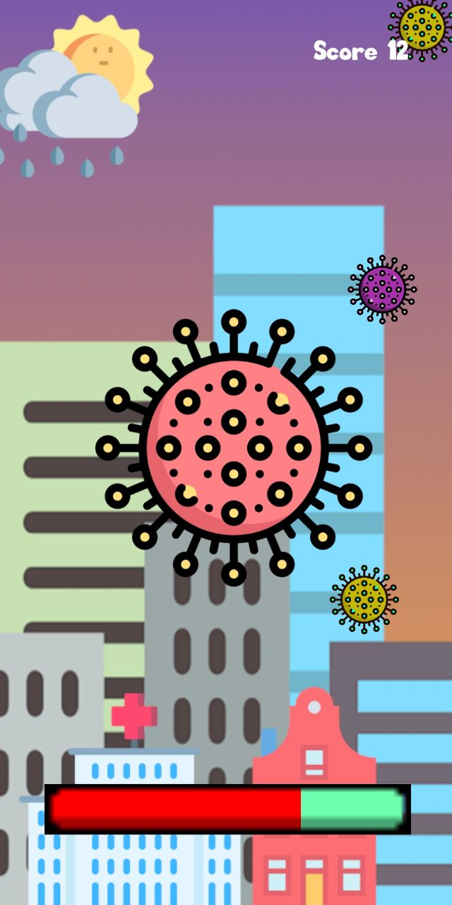

# VirusSmasher
Android Game - First Release

Il gioco è stato realizzato utilizzando Unity & C#
La meccanica di  gioco consiste nel prendere i piccoli virus prima che cadano sulla barra di energia
L'obiettivo è cercare di evitare che la barra si riempi

Gli sprite ed altre immagini sono prese da Freepic e Pixabay
